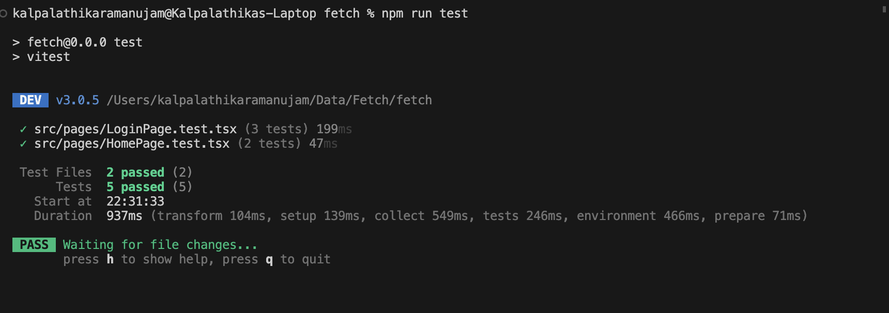
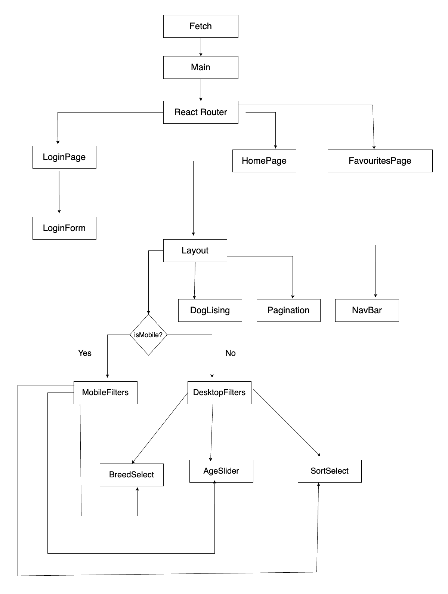

# Fetch App - React + TypeScript + Vite

## Overview

Fetch App is a web application designed for dog lovers to explore, filter, and interact with various dog listings. It provides a user-friendly interface to search, filter, sort, and manage favorite dog profiles. The application is built using a React frontend and leverages Redux for state management, ensuring a responsive user experience.

https://fetch-kalpalathika-ramanujam.netlify.app/

## Getting Started

### Prerequisites

- Node.js (v20.12.2 or above)
- Docker (optional)

### Installation

#### Option 1: Using Docker

1. Clone the repository:
`git clone https://github.com/kalpalathika/fetch.git`

2. Build and run the application using Docker:
`docker build -t my-vite-react-app` 

3. Run in detatched mode:
`docker run -d -p 3000:8000 my-vite-react-app`

4. To stop docker:
`docker stop <id>`

5. To delete the container: 
`docker rm <id>`

4. Access the application: Open your web browser and visit `http://localhost:3000`.

#### Option 2: Using Node.js

1. Clone the repository:
`git clone https://github.com/kalpalathika/fetch.git`

2. Install dependencies:
`npm install`

3. Start the application:
`npm run start`

4. Access the application: Open your web browser and visit `http://localhost:5173`.

## Running Tests
To run integration tests, execute the following command:
npm run test

## Routes 
1. Login `/`
2. Home   `/home`
3. Favourites `/favourites`

### Component Architecture  

 
## APIs Used
1. POST /auth/login
2. POST /auth/logout
3. GET /dogs/breeds
4. GET /dogs/search
5. POST /dogs
6. POST /dogs/match
7. POST /locations

## Features
- **Authentication:** Secure login and logout functionality.
- **Dog Filters:** Ability to filter dogs by breeds and age.
- **Sorting Options:** Users can sort listings by breed, name, or age in ascending or descending order.
- **Pagination:** Supports browsing through dog listings in a paginated format.
- **Favorites Management:** Users can add or remove dogs from their favorites.
- **Matchmaking:** Feature to generate matches for dogs, displayed using a modal.
- **Responsive Design:** Fully responsive layout that adapts to various device screens.
- **Error Handling:** Render meaningful error messages whenever required 
- **Persistent Favourites:** Favourite dogs are retained during the session until logout.

## Tech Stack

- **Frontend:** 
1. React 
2. React Router DOM 
3. Typescript 
4. Tailwind CSS
5. React Query
6. Recoil
7. react-select library
8. react-paginate libabrary
9. HTML 

- **Testing:** 
1. Vitest 
2. React Testing Library

## Future Scope
1. More test case coverage
2. Caching for Pagination
3. Add Location filters

## About Me
I am Kalpalathika Ramanujam, a dedicated Software Engineer with over three years of industry experience specializing in developing scalable full-stack applications using React, Angular and C# .Net. Currently, I am pursuing my Master’s in Computer Science at Rochester Institue of Technology. As a skilled problem solver, I am eager to apply my technical expertise and innovative approach in a dynamic new role.